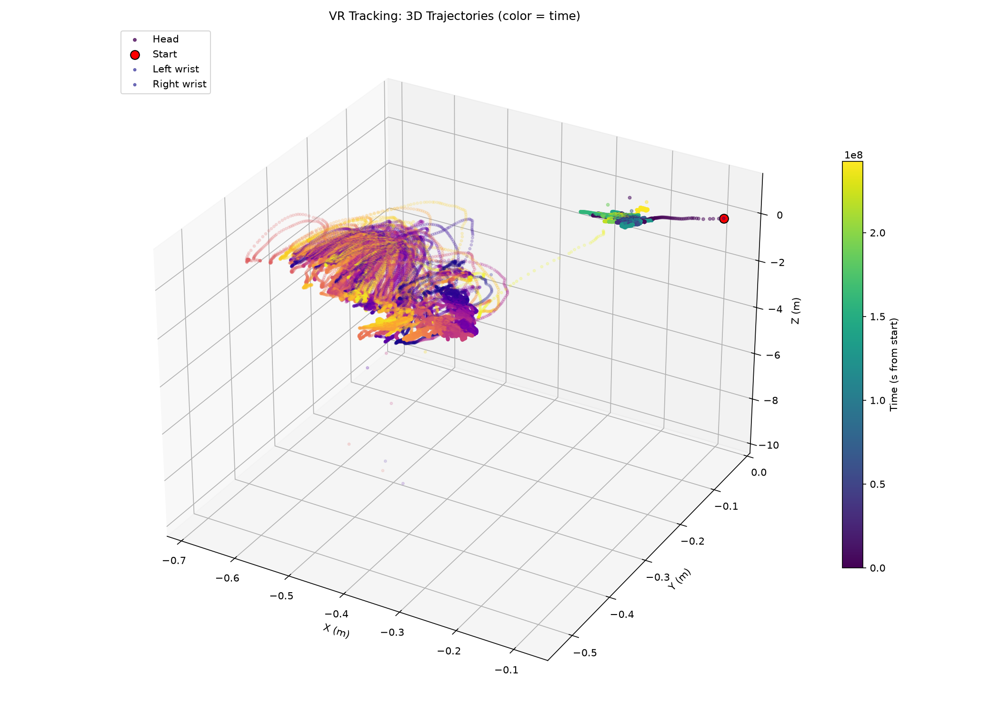
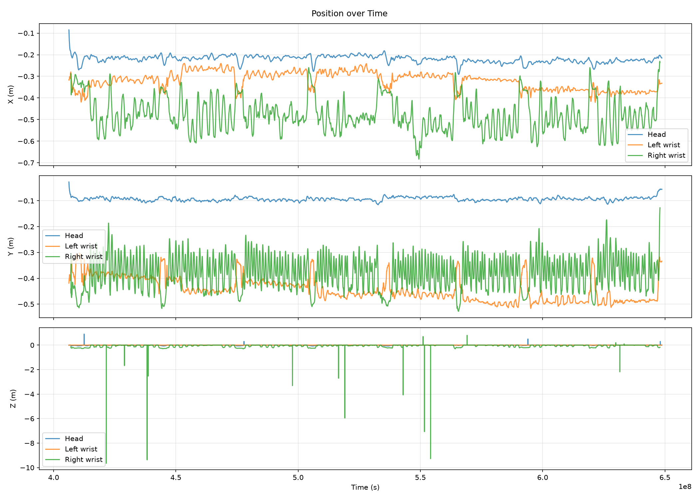

# Визуализация VR-трекинга (XRoboToolkit)

Проект по визуализации данных трекинга головы и рук, записанных VR-устройством.

## Что делает

1. Парсит файл `trackingData_20260505_165740.txt` (формат JSON Lines).
2. Преобразует данные в `pandas.DataFrame`.
3. Строит две визуализации:
   - 3D-траектории головы и запястий рук, раскрашенные по времени;
   - графики координат X/Y/Z во времени.

## Выбранный подход

Выбрал 3D-визуализацию траекторий. Она сразу показывает, как пользователь перемещался в пространстве: где была голова, как двигались руки. Цвет точки кодирует время — это добавляет четвёртое измерение и помогает понять направление движения.

Дополнительно построил графики координат во времени — на них видны детали, которые на 3D-графике сливаются: резкие движения головы, паузы в работе рук.

## Структура репозитория

```
.
├── data/
│   └── trackingData_20260505_165740.txt
├── src/
│   ├── parser.py
│   └── visualize.py
├── results/
│   ├── trajectories_3d.png
│   └── position_timeseries.png
├── requirements.txt
└── README.md
```

## Установка и запуск

```bash
git clone https://github.com/solodkiy4321-droid/xr-tracking-viz.git
cd xr-tracking-viz

python -m venv venv
source venv/bin/activate          # Linux / macOS
# venv\Scripts\activate           # Windows

pip install -r requirements.txt
```

Положите `trackingData_20260505_165740.txt` в папку `data/` и запустите:

```bash
python src/visualize.py
```

Результаты появятся в `results/`.

## Формат входных данных

Файл — это JSON Lines: каждая строка — отдельный JSON-объект.

Первая строка — служебная, содержит калибровку камеры:
- `timeStampNs` — время в наносекундах;
- `cameraExtrinsics` — матрица 4×4 внешних параметров камеры;
- `cameraIntrinsics` — внутренние параметры `[fx, fy, cx, cy]`.

Остальные строки — кадры трекинга (~90 Гц):
- `predictTime` — метка времени;
- `Head.pose` — поза головы: `x, y, z, qx, qy, qz, qw`;
- `Head.status` — статус трекинга головы;
- `Hand.leftHand` / `Hand.rightHand`:
  - `isActive` — отслеживается ли рука;
  - `count: 26` — число суставов кисти;
  - `HandJointLocations` — массив из 26 суставов, каждый с позой `p`, радиусом `s` и полем `r`.

Особенность: числа в строках позы используют запятую как десятичный разделитель (`-0,08517717`). Парсер учитывает это через регулярное выражение.

## Пример результата





## Наблюдения

- Частота трекинга соответствует документации XRoboToolkit — около 90 Гц.
- Амплитуда движения головы меньше, чем рук — пользователь в основном работал контроллерами.
- В части кадров `isActive` для рук равен 0 (рука терялась из виду). Такие кадры в DataFrame попадают как `NaN` и не отображаются на графике.
- Служебная строка с параметрами камеры встречается в файле один раз — в самом начале.

## Сложности

- Формат `trackingData_*.txt` не документирован в открытых репозиториях XR-Robotics. Структуру разбирал вручную, опираясь на документацию XRoboToolkit и стандарт OpenXR Hand Tracking.
- Запятая как десятичный разделитель внутри строк `pose` ломает наивный `split(',')`. Использовал регулярное выражение, которое находит числа целиком.
- Вложенная структура JSON (руки → суставы) не даёт применить `pandas.read_json` или `read_csv` напрямую — потребовался построчный парсинг с ручным «расплющиванием».
- Кватернионы ориентации сохраняются в DataFrame, но в текущей визуализации не используются. Для отображения ориентации головы или кисти нужна отдельная логика.

## Что можно улучшить

- Анимация траектории: точки появляются во времени.
- Скелетная анимация кисти: использовать все 26 суставов вместо одного запястья.
- Наложение трекинга на видео через `cameraIntrinsics` и `cameraExtrinsics`.
- Интерактивная визуализация на `plotly` или `rerun`.

## Зависимости

- Python 3.10+
- pandas
- numpy
- matplotlib